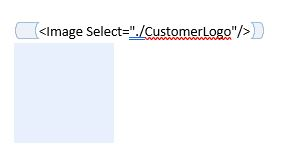
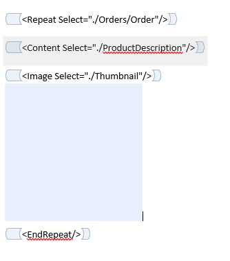
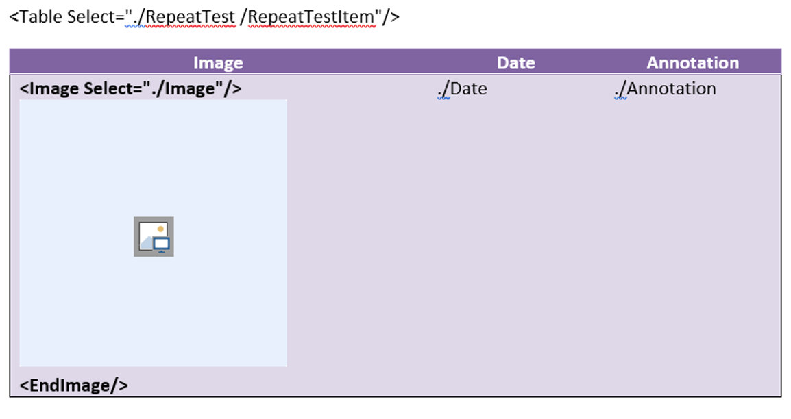

# Key highlights from [#31](https://github.com/sergey-tihon/Clippit/pull/31#issuecomment-874335292)

## Introduction

The Image content control works by being placed directly before an image placeholder in your Word document.  The image placeholder must be inline.

Images content can be provided in your XML data using a path to a file on disk, or by using the [data URI scheme](https://en.wikipedia.org/wiki/Data_URI_scheme).  Example of both approaches are shown below: 

```xml
<Logo>../../md-logo.png</Logo>
```
```xml
<Image>data:image/jpg;base64,/9j/4AAQSkZJRgABAQEAYABgAAD/2wBDAAgGBgcGBQgHBwcetc…</Image>
```

Document Assembler will either infer the MIME type based on the extension of the filename, or take use the MIME type passed in when using the data URI scheme.

Examples below show the Image content control in action and are taken from the Document Assembler Test Files:

## Image Select



## Image Select within a Repeat

Note that when using a Repeat XPATH is aware of the Context it is in and should operate on the "current" Node.



## Image Select within a Table

Works in a very similar way to Repeat.



## XML Data used in above Examples

```xml
<?xml version="1.0" encoding="utf-8"?>
<Customer>
  <CustomerID>1</CustomerID>
  <Name>Cheryl</Name>
  <HighValueCustomer>True</HighValueCustomer>
  <CustomerLogo>../../../../TestFiles/img.png</CustomerLogo>
  <Header>../../../../TestFiles/T0936_files/image001.png</Header>
  <Orders>
    <Order>
      <ProductDescription>Unicycle</ProductDescription>
      <Quantity>3</Quantity>
      <OrderDate>9/5/2001</OrderDate>
	  <Thumbnail>../../../../TestFiles/img2.png</Thumbnail>
    </Order>
    <Order>
      <ProductDescription>Tricycle</ProductDescription>
      <Quantity>3</Quantity>
      <OrderDate>8/6/2000</OrderDate>
	  <Thumbnail>data:image/png;base64,iVBORw0KGgoAAAANSUhEUgAAAMcAAACTCAYA...</Thumbnail>	  
    </Order>
  </Orders>
  <TotalQuantity>6</TotalQuantity>
  <Description><![CDATA[This
is a multiline
description that
contains details about
Cheryl.]]></Description>
</Customer>
```

## Further Reading

If you are interested in using the Image functionality in DocumentAssembler then you best bet is to look at `DocumentAssemblerTests.cs` and particularly the data files which can be found in the repository under `Test Files/DA`.

Changes merged in: [#31](https://github.com/sergey-tihon/Clippit/pull/31)