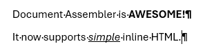

# Inline HTML Support

## Introduction

Document Assembler now supports basic inline HTML tags and if these are found in your Content select then formatting will be placed directly on the run.

For example assuming you had an XML file with an HTML fragment such as:

```xml
<doc>
    <fragment>
        <p>Document Assembler is <b>AWESOME!</b></p>
        <p>It now supports <u><i>simple</i></u> inline HTML.</p>
    </fragment>
</doc>
```

And you had a `Content` tag in your template:

```xml
<Content Select="//fragment[1]" />
```

Then Document Assembler would render this in Word as:



## Supported HTML tags

Currently the following HTMl tags are supported.

### Block Tags

Both `div` and `p` tags are supported for block level content.  When Document Assembler finds either of these then it will treat them as an encapsulating paragraph.

### Inline Tags

* Either `b` or `strong` are supported for Bold
* Either `i` or `em` are support for Italic
* `u` is translated to Underline
* `a` will create a clickable Hyperlink in Word
* `br` forces a new line

## HTML Parsing

HTML parsing is provided using the HTML Agility Pack and is fairly forgiving.  If you have HTML elements in use that are not supported Document Assembler will simply ignore them and process the rest of your content.

## Usage in Templates

Inline HTML formatting is supported by default, you do not need to change your `Content` elements, you just need to pass valid HTML rather than text to them in the `Select` attribute.

## Future Developments

Inline HTML support is in it's infancy but it would make sense to add support for:

* Ordered lists <a href="https://developer.mozilla.org/en-US/docs/Web/HTML/Element/ol" target="_blank">`ol`</a>
* Unordered lists <a href="https://developer.mozilla.org/en-US/docs/Web/HTML/Element/ul" target="_blank">`ul`</a>
* Superscript <a href="https://developer.mozilla.org/en-US/docs/Web/HTML/Element/sup" target="_blank">`sup`</a>
* Subscript <a href="https://developer.mozilla.org/en-US/docs/Web/HTML/Element/sub" target="_blank">`sup`</a>
* Strike-through <a href="https://developer.mozilla.org/en-US/docs/Web/HTML/Element/s" target="_blank">`s`</a>